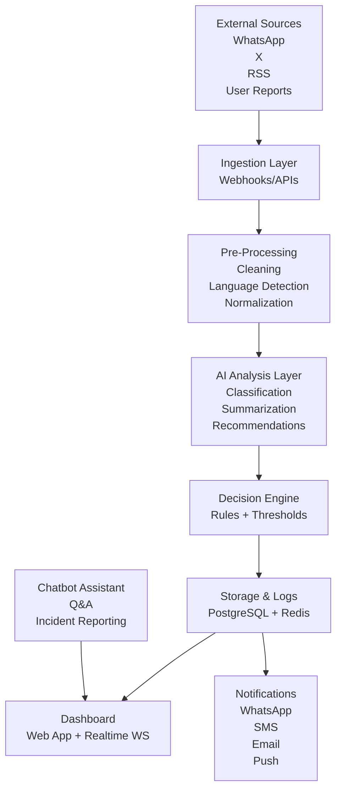

# Patrol-X — Project Specification (Workflow + Architecture)

## 📌 Overview
Patrol-X is an intelligent real-time information analysis system that collects content from multiple sources, filters relevance, summarizes key points, and suggests appropriate actions to help users make informed and rapid decisions in critical or everyday contexts.

---

## 🚦 1. Final Workflow (End-to-End)

### 🔹 Step 1 — Data Ingestion
Sources connected via APIs or Webhooks:
- WhatsApp (Cloud API / Twilio Sandbox)
- X / Twitter (API v2 feed or search)
- RSS / Trusted news feeds
- Manual reports (Web form or Chatbot)

**Standardized event object:**
```json
{
  "text": "...",
  "source": "whatsapp|twitter|rss|chatbot",
  "timestamp": "2025-01-01T10:00:00Z",
  "metadata": {}
}
```

---

### 🔹 Step 2 — Pre-Processing
Transform and prepare text:

- Language detection (HT / FR / EN)
- Text cleaning (noise, emojis, spam, duplicates)
- Optional: Entity & location extraction

**Output:** `clean_text`

---

### 🔹 Step 3 — AI Analysis Layer

1. **Relevance Classification**  
   → `Not Relevant | Relevant | Urgent`
2. **Summarization (1–2 sentences)**  
   → Clear, neutral, factual
3. **Recommended Action**  
   → `Ignore | Save | Notify | Alert | Verify`
4. **Confidence score**  
   → `0.00 – 1.00`

**AI Output Example:**
```json
{
  "relevance": "Urgent",
  "summary": "Roadblock reported near Delmas 33.",
  "recommendation": "Send alert to nearby users.",
  "confidence": 0.87
}
```

---

### 🔹 Step 4 — Decision Engine (Rules + Thresholds)

| Condition                          | System Action           |
|-----------------------------------|--------------------------|
| Urgent + confidence >= threshold  | Immediate alert          |
| Relevant                          | Display in dashboard     |
| Low confidence                    | Flag for human review    |
| Not relevant                      | Archive silently         |

---

### 🔹 Step 5 — Dashboard & Notifications

**Dashboard table columns:**

| Source | Summary | Score | Recommendation | Actions |
|--------|---------|--------|----------------|----------|

User actions:  
✔ Confirm • ✔ Override • ✔ Dismiss

Notification channels:  
- WhatsApp Alert  
- SMS  
- Push Notification  
- Email Digest  

---

### 🔹 Step 6 — Chatbot Assistant

Chatbot capabilities:
- Q&A about recent alerts and summaries
- Natural language incident reporting
- Explanation of classifications
- Safety advisory (non-authoritative)

**Important:** Retrieval-based answers, avoid hallucination.

---

### 🔹 Step 7 — Storage, Logs & Continuous Learning

Stored in database:
- Raw text  
- Clean processed data  
- AI outputs  
- Decision logs  
- User feedback  

Used later for model improvement and analytics.

---

## 🧩 Visual Workflow Diagram

```
Sources
   ↓
Ingestion (Webhook/API)
   ↓
Pre-Processing (clean/standardize)
   ↓
AI Analysis (classify → summarize → recommend)
   ↓
Decision Engine (rules & thresholds)
   ↓
Dashboard + Notifications + Chatbot
   ↓
Storage + Logs + Feedback Loop
```

---

## 🏗️ System Architecture Diagram


---

## 🎯 Expected Impact

- Faster, clearer and more reliable access to information
- Improved decision-making for individuals and organizations
- Reduced misinformation and confusion
- Real-world benefits including **risk reduction and potentially saving lives**

---

## 📎 Notes for Team

- MVP must focus on **one input source**, not all
- Prioritize clarity over complexity
- AI responses must be **explainable + safe**
- Chatbot should **never** claim absolute truth

---

## 👥 Target Users
Citoyens, ONG, Autorités publiques, Journalistes
